# Santelle Payment Flow Diagram

This diagram illustrates the complete user journey from signup through subscription purchase and fulfillment.

## Sequence Diagram

```mermaid
sequenceDiagram
    participant User
    participant Client as Client (Next.js)
    participant Netlify as Netlify Functions
    participant Stripe
    participant Supabase
    participant Resend

    %% Login/Signup Flow
    rect rgb(240, 248, 255)
        Note over User,Supabase: 1. LOGIN/SIGNUP FLOW
        User->>Client: Login/Signup
        Client->>Supabase: Supabase Auth UI
        Supabase-->>Supabase: Verify session
        Supabase-->>Supabase: Create/Update profiles row (trigger/upsert)
        Supabase-->>Client: Session established
    end

    %% Quiz to Checkout Flow
    rect rgb(255, 250, 240)
        Note over User,Stripe: 2. QUIZ → PLAN SELECTION
        User->>Client: Complete Quiz
        User->>Client: Click "Get kit + app"
        Client->>Netlify: POST /api/checkout
        Note over Netlify: Validate user session
        
        alt Stripe customer doesn't exist
            Netlify->>Stripe: Create Stripe customer
            Netlify->>Supabase: Save stripe_customer_id to profiles
        end
        
        Netlify->>Stripe: Create Checkout Session<br/>(mode: subscription,<br/>automatic_tax: enabled,<br/>collect shipping address)
        Stripe-->>Netlify: session.id + session.url
        Netlify-->>Client: { sessionId, url }
    end

    %% Stripe Checkout Flow
    rect rgb(240, 255, 240)
        Note over User,Stripe: 3. STRIPE CHECKOUT
        Client->>Stripe: Redirect to Stripe Checkout
        User->>Stripe: Enter payment details
        User->>Stripe: Enter shipping address
        Stripe->>Stripe: Calculate tax automatically
        User->>Stripe: Confirm payment
        Stripe-->>Client: Redirect to success_url
    end

    %% Webhook Processing Flow
    rect rgb(255, 240, 255)
        Note over Netlify,Resend: 4. WEBHOOK PROCESSING
        Stripe->>Netlify: Webhook: checkout.session.completed
        Note over Netlify: Verify webhook signature
        
        Netlify->>Stripe: Retrieve full session details<br/>(subscription, customer, line items)
        Stripe-->>Netlify: Session data
        
        Netlify->>Supabase: Map stripe_customer_id → user
        
        par Update Profile
            Netlify->>Supabase: UPDATE profiles:<br/>- subscription_status: 'active'<br/>- subscription_id<br/>- plan_id<br/>- current_period_start<br/>- current_period_end
        and Create Order
            Netlify->>Supabase: INSERT orders:<br/>- customer_id<br/>- shipping_name<br/>- shipping_address<br/>- shipping_rate<br/>- amount_total<br/>- status: 'queued'
        and Create Order Items
            Netlify->>Supabase: INSERT order_items:<br/>- product details<br/>- quantity<br/>- price
        end
        
        Note over Netlify: Create fulfillment job (optional)
        
        Netlify->>Resend: Send "Welcome + Order Confirmed" email
        Resend-->>User: Email delivered ✅
        
        Netlify-->>Stripe: Return 200 OK
    end

    %% Recurring Subscription Flow
    rect rgb(255, 255, 230)
        Note over Stripe,Resend: 5. RECURRING BILLING (Future)
        
        Stripe->>Netlify: Webhook: invoice.payment_succeeded
        Netlify->>Supabase: UPDATE profiles:<br/>- current_period_end (renewed)
        Netlify->>Supabase: INSERT orders (new kit shipment)
        Netlify->>Resend: Send "Subscription Renewed" email
        Resend-->>User: Email delivered ✅
        
        alt Payment Failed
            Stripe->>Netlify: Webhook: invoice.payment_failed
            Netlify->>Supabase: UPDATE profiles:<br/>- subscription_status: 'past_due'
            Netlify->>Resend: Send "Payment Failed" email
            Resend-->>User: Email delivered ⚠️
        end
    end

    %% Subscription Management Flow
    rect rgb(250, 240, 255)
        Note over User,Stripe: 6. SUBSCRIPTION MANAGEMENT
        User->>Client: Access "Manage Subscription"
        Client->>Netlify: POST /api/create-portal-session
        Netlify->>Stripe: Create billing portal session
        Stripe-->>Netlify: portal.url
        Netlify-->>Client: { url }
        Client->>Stripe: Redirect to portal
        User->>Stripe: Update payment method<br/>or Cancel subscription
        
        alt Subscription Canceled
            Stripe->>Netlify: Webhook: customer.subscription.deleted
            Netlify->>Supabase: UPDATE profiles:<br/>- subscription_status: 'canceled'<br/>- canceled_at
        end
    end

    %% UI Gating Flow
    rect rgb(245, 245, 245)
        Note over User,Supabase: 7. UI GATING & FEATURE ACCESS
        User->>Client: Navigate to premium features
        Client->>Supabase: Query /profiles (RLS protected)
        Supabase-->>Client: { subscription_status, plan_id }
        
        alt Active Subscription
            Note over Client: status ∈ {active, trialing}
            Client->>Client: Show premium features ✅
        else No Active Subscription
            Note over Client: status ∈ {canceled, past_due, null}
            Client->>Client: Show paywall/upgrade prompt 🔒
        end
    end
```



## Flow States

### Subscription Status Values
- `trialing` - Free trial period (if configured)
- `active` - Subscription active and paid
- `past_due` - Payment failed, retry in progress
- `canceled` - Subscription canceled (access until period_end)
- `unpaid` - Payment failed multiple times

### Order Status Values
- `queued` - Order created, awaiting fulfillment
- `processing` - Being prepared for shipment
- `shipped` - Sent to customer (tracking available)
- `delivered` - Confirmed delivery
- `failed` - Delivery failed
- `refunded` - Order refunded

## Key Integration Points

### 1. Supabase Triggers (Recommended)
```sql
-- Auto-create Stripe customer reference on profile creation
CREATE OR REPLACE FUNCTION handle_new_user()
RETURNS TRIGGER AS $$
BEGIN
  -- Profile created, ready for Stripe customer creation on first checkout
  RETURN NEW;
END;
$$ LANGUAGE plpgsql SECURITY DEFINER;
```

### 2. Netlify Functions
- `/api/checkout` - Creates Stripe checkout session
- `/api/stripe-webhook` - Handles all Stripe events
- `/api/create-portal-session` - Customer billing portal access

### 3. Stripe Configuration
- **Checkout Mode:** `subscription`
- **Automatic Tax:** Enabled
- **Shipping:** Address collection enabled
- **Payment Methods:** Card, Apple Pay, Google Pay

### 4. Resend Email Triggers
- Order confirmation (immediate)
- Subscription renewal reminder (3 days before)
- Payment failed (immediate)
- Subscription canceled (immediate)
- Shipment tracking (when fulfilled)

## Security Considerations

1. **Webhook Verification:** All webhooks verify Stripe signature
2. **RLS Policies:** Supabase Row Level Security prevents unauthorized access
3. **CORS:** Netlify functions restricted to your domain
4. **Rate Limiting:** Prevent abuse of checkout endpoints
5. **Input Validation:** All user inputs sanitized

## Testing Checklist

- [ ] Complete checkout with test card (4242 4242 4242 4242)
- [ ] Verify webhook received and processed
- [ ] Confirm profile updated with subscription_status
- [ ] Verify order created in database
- [ ] Check email delivery
- [ ] Test failed payment (4000 0000 0000 0002)
- [ ] Test subscription cancellation via portal
- [ ] Verify UI gating works correctly
- [ ] Test recurring billing (Stripe CLI)

## Monitoring Points

- Stripe Dashboard: Payment success/failure rates
- Supabase: Order status distribution
- Resend: Email delivery rates
- Netlify Functions: Error logs and execution times
- Customer Support: Failed payment patterns

---

**View this diagram:** 
- GitHub: Renders automatically in PR/README
- [Mermaid Live Editor](https://mermaid.live)
- VS Code: Install "Markdown Preview Mermaid Support" extension

